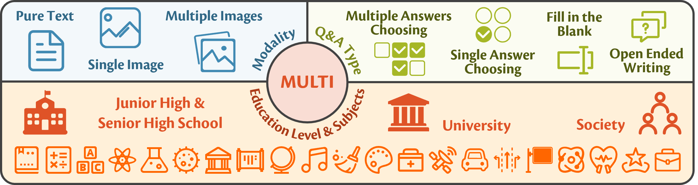

# 🖼️ MULTI-Benchmark: Multimodal Understanding Leaderboard with Text and Images

<div align="center">



🌐 [Website](https://OpenDFM.github.io/MULTI-Benchmark/) | 📃 [Paper](https://arxiv.org/abs/2402.03173/) | 🤗 [Dataset](https://huggingface.co/datasets/OpenDFM/MULTI-Benchmark) | 🎯 [Leaderboard]() (Coming Soon) 

[简体中文](./README_zh.md) | English

</div>

## 🔥 News

- **[Cooming Soon]** We will release the official evaluation platform.
- **[2024.2.19]** We release the [HuggingFace Page](https://huggingface.co/datasets/OpenDFM/MULTI-Benchmark/).
- **[2024.2.6]** We publish our [paper](https://arxiv.org/abs/2402.03173/) on arXiv.
- **[2023.12.7]** We release the [code](./eval) of our benchmark evaluation.
- **[2023.12.5]** We release the [GitHub Page](https://OpenDFM.github.io/MULTI-Benchmark/).

## 📖 Overview

Rapid progress in multimodal large language models (MLLMs) highlights the need to introduce challenging yet realistic benchmarks to the academic community, while existing benchmarks primarily focus on understanding simple natural images and short context. In this paper, we present ***MULTI***, as a cutting-edge benchmark for evaluating MLLMs on understanding complex tables and images, and reasoning with long context. **MULTI** provides multimodal inputs and requires responses that are either precise or open-ended, reflecting real-life examination styles. **MULTI** includes over 18,000 questions and challenges MLLMs with a variety of tasks, ranging from formula derivation to image detail analysis and cross-modality reasoning. We also introduce ***MULTI-Elite***, a 500-question selected hard subset, and ***MULTI-Extend***, with more than 4,500 external knowledge context pieces. Our evaluation indicates significant potential for MLLM advancement, with GPT-4V achieving a **63.7%** accuracy rate on **MULTI**, in contrast to other MLLMs scoring between **28.5%** and **55.3%**. **MULTI** serves not only as a robust evaluation platform but also paves the way for the development of expert-level AI.

## 🏆 Leaderboard

| Modality |     Model     | Version                    | Overall | MULTI-Elite |
|:--------:|:-------------:| -------------------------- |:-------:|:-----------:|
|    🖼️    |    GPT-4V     | gpt-4-vision-preview       |  63.7   |    14.0     |
|    🖼️    |     Yi-VL     | Yi-34B-Chat                |  55.3   |    26.2     |
|    🖼️    | Gemini Vision | gemini-pro-vision          |  53.7   |    12.4     |
|    📃    |    Gemini     | gemini-pro                 |  52.2   |    10.5     |
|    📃    |     GPT-4     | gpt-4-1106-preview         |  50.2   |     5.8     |
|    📃    |    DFM-2.0    | dfm-2.0-70b-preview        |  49.7   |    18.0     |
|    🖼️    |   InternVL    | InternVL-Chat-Chinese-V1.1 |  44.9   |    20.7     |
|    🖼️    |    Qwen-VL    | Qwen-VL-Chat               |  39.0   |    10.5     |
|    📃    |    ChatGPT    | gpt-3.5-turbo-1106         |  35.9   |     4.7     |
|    🖼️    |    VisCPM     | VisCPM-Chat                |  33.4   |    13.0     |
|    📃    |     MOSS      | moss-moon-003-sft          |  32.6   |    13.1     |
|    🖼️    |   VisualGLM   | visualglm-6b               |  31.1   |    12.8     |
|    🖼️    | Chinese-LLaVA | Chinese-LLaVA-Cllama2      |  28.5   |    12.3     |

For more details, please visit our [leaderboard]() (Coming Soon).

## ⏬ Download

You can download the dataset from the [HuggingFace Page](https://huggingface.co/datasets/OpenDFM/MULTI-Benchmark). Current [version](https://huggingface.co/datasets/OpenDFM/MULTI-Benchmark/blob/main/MULTI_v1.2.2_20240212_release.zip) is `v1.2.2`.

```
wget https://huggingface.co/datasets/OpenDFM/MULTI-Benchmark/resolve/main/MULTI_v1.2.2_20240212_release.zip
unzip MULTI_v1.2.2_20240212_release.zip -d ./data
```

## 📝 How to Evaluate

This will be updated soon. Please refer to the [legancy README](./eval/models/README.md) for now.

## 📮 How to Submit

You need to first prepare a UTF-8 encoded JSON file with the following format:

```
{
    "czsx_0_0": {
        "question_id": "czsx_0_0",
        "question_image_number": 1,
        "image_list": [...],
        "input_message": ...,
        "prediction": "C"
    },
    ...
}
```
If you evaluate the model with our official code, you can simply zip the experiment result folder `./results/EXPERIMENT_NAME`. 

Then, you can submit your result to our [evaluation platform](https://wj.sjtu.edu.cn/q/89UmRAJn) (Coming Soon).

Thank you for being so interested in the **MULTI** dataset! As the automated evaluation platform is not yet online, please fill in [this questionnaire](https://wj.sjtu.edu.cn/q/89UmRAJn) to get the evaluation results, your information will be kept strictly confidential, so please feel free to fill it out. 🤗

You are also welcome to pull a request and contribute your code to our evaluation code. We will be very grateful for your contribution!

## 📑 Citation

If you find our work useful, please citing us!

```
@misc{zhu2024multi,
      title={{MULTI}: Multimodal Understanding Leaderboard with Text and Images}, 
      author={Zichen Zhu and Yang Xu and Lu Chen and Jingkai Yang and Yichuan Ma and Yiming Sun and Hailin Wen and Jiaqi Liu and Jinyu Cai and Yingzi Ma and Situo Zhang and Zihan Zhao and Liangtai Sun and Kai Yu},
      year={2024},
      eprint={2402.03173},
      archivePrefix={arXiv},
      primaryClass={cs.CL}
}
```

## 📧 Contact Us

If you have any questions, please feel free to contact us via email `JamesZhutheThird@sjtu.edu.cn` and `xuyang0112@sjtu.edu.cn`
